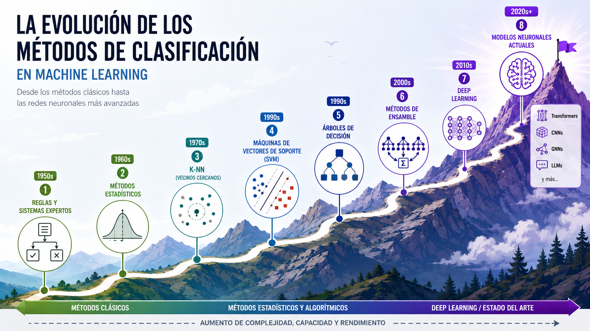
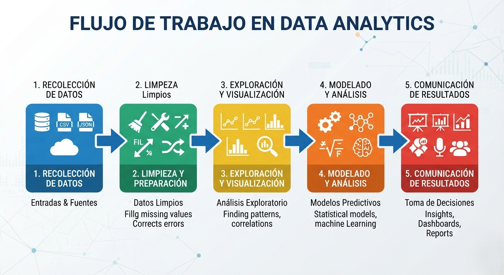

# 🚀 Descubriendo el Poder de la Analítica de Datos

Este capítulo será tu primer paso hacia un mundo donde los **datos** cuentan **historias** y guían **acciones**.  
La **historia de la analítica de datos** comienza mucho antes de que existieran las **computadoras modernas**. Sus raíces se encuentran en la **estadística** y la necesidad de **organizar información** para **tomar decisiones**: desde los **censos en la antigüedad** hasta los primeros **estudios de mercado** en el siglo XX. Con la llegada de las **computadoras** en los años 60 y 70, la capacidad de **procesar grandes volúmenes de datos** se multiplicó. En los 90, el auge de **internet** disparó la **generación de información**, y en la última década, el **big data** y la **inteligencia artificial** han llevado la analítica a un nivel donde se pueden procesar millones de **registros** en segundos y descubrir **patrones** invisibles para el ojo humano. Hoy, la **analítica** es un **pilar** en **empresas**, **ciencia** y **vida cotidiana**.  

Es cierto que a lo largo del tiempo han cambiado las formas de **recolección**, **limpieza**, **preparación**, **exploración** y **visualización de datos**, pero el salto más grande ha sido en el **modelado**. Al inicio se usaban **reglas simples** y **sistemas expertos**; luego llegaron métodos **estadísticos** como la **clasificación bayesiana**, algoritmos de **vecinos cercanos** y **máquinas de vectores de soporte**. Más tarde aparecieron los **métodos de ensamble**, como los **bosques aleatorios**, que combinan múltiples **modelos** para mejorar la **precisión**. Finalmente, las **redes neuronales** revolucionaron el campo al permitir que los sistemas aprendieran **representaciones complejas** y **no lineales**. En el fondo, todos estos enfoques buscan lo mismo: **encontrar patrones** y **clasificar datos**, de modo que incluso **información nueva** y nunca vista pueda ser ubicada en **categorías** ya aprendidas.  

## 📖 Introducción

La analítica de datos combina matemáticas, estadística y programación para transformar información en conocimiento útil.  
En este capítulo aprenderás:

- Qué es la analítica de datos y cómo se aplica.  
- Los diferentes tipos de análisis que existen.  
- Ejemplos prácticos que muestran su utilidad en la vida cotidiana. 
- Flujo de Trabajo en Data Analytics 

---

## 📚 Definiciones

### ¿Qué es Analítica de Datos?
La analítica de datos es el proceso de examinar, limpiar y transformar datos para descubrir patrones, tendencias e información útil que ayude a tomar mejores decisiones.  

### Una explicación cotidiana
Imagina que tienes un diario personal donde registras tu estado de ánimo cada día. Con el tiempo, puedes notar que los lunes estás más cansado y los viernes más feliz. Eso es analítica de datos: **buscar patrones en la información para entender mejor tu realidad**.

---

## 🔎 Tipos de Analíticas

Existen cuatro grandes tipos de analítica:

1. **Descriptiva** → Explica qué pasó.  
2. **Diagnóstica** → Investiga por qué pasó.  
3. **Predictiva** → Anticipa qué podría pasar.  
4. **Prescriptiva** → Sugiere qué hacer al respecto.  

### Ejemplo sencillo
Supongamos que registras cuántas tazas de café tomas al día:  
- **Descriptiva:** “Ayer tomé 3 tazas.”  
- **Diagnóstica:** “Tomé más café porque dormí poco.”  
- **Predictiva:** “Si duermo mal, probablemente tomaré más café mañana.”  
- **Prescriptiva:** “Debería dormir mejor para reducir mi consumo de café.”  

---

## 🌍 Importancia en el Mundo Actual

La analítica de datos está presente en casi todos los ámbitos:  
- **Empresas:** optimizan ventas y logística.  
- **Investigación académica:** descubren patrones en grandes volúmenes de datos.  
- **Vida diaria:** aplicaciones móviles que recomiendan rutas, música o hábitos saludables.  

### Ejemplo destacado: Salud Pública  
Durante una epidemia, los datos ayudan a identificar zonas de mayor contagio y a diseñar estrategias de prevención más efectivas.

---

## ⚙️ Flujo de Trabajo en Data Analytics

El proceso típico incluye:  
1. **Recolección de datos** → obtener información de distintas fuentes.  
2. **Limpieza y preparación** → corregir errores y organizar datos.  
3. **Exploración y visualización** → descubrir patrones y relaciones.  
4. **Modelado y análisis** → aplicar técnicas estadísticas o de machine learning.  
5. **Comunicación de resultados** → presentar hallazgos de forma clara y útil.  

---
